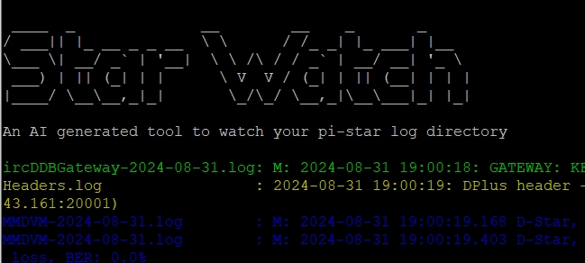

# Pi-Star Log Watcher

A real-time log monitoring tool for Pi-Star systems. This script watches a specified directory for changes to log files and displays new entries as they occur. Each file is printed in a distinct color to help visually distinguish between multiple sources of logs. This tool is especially useful for Raspberry Pi-based ham radio setups running Pi-Star.

---

## 📌 Features

- ✅ **Real-Time Monitoring** — Watches a directory for log file updates using `watchdog`.
- ✅ **Colorized Output** — Each log file gets a unique color using `colorama`, making it easy to identify where messages are coming from.
- ✅ **Clean Output Format** — Aligns file names for consistent, readable output.
- ✅ **Auto-Tail Behavior** — Reads only the newly appended lines, like `tail -f`.
- ✅ **Simple to Use** — Just run the script and observe logs as they happen.
- ✅ **Keyboard Interrupt Support** — Stop watching any time using `Ctrl+C`.

---

## 📂 Use Case

This tool is ideal for amateur radio operators or system administrators monitoring Pi-Star logs, such as:

- `DStarRepeater.log`
- `DMRGateway.log`
- `YSFGateway.log`
- `MMDVM-*.log`

You can point it at any log directory, not just `/var/log/pi-star`.

---

## 👨‍💻 Author

**William McEvoy**

---

## 🧰 Requirements

This script is written in Python 3 and requires the following libraries:

| Package   | Purpose                   | Installation Command                 |
|-----------|---------------------------|--------------------------------------|
| `watchdog`| File system monitoring    | `pip install watchdog`               |
| `colorama`| Terminal color support    | `pip install colorama`               |

---

## 📦 Installation

### 1. Clone the Repository

```bash
git clone https://github.com/your-username/pi-star-log-watcher.git
cd pi-star-log-watcher


